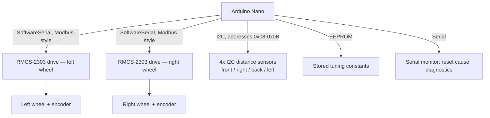

# Rescue Maze Robot

Arduino Nano, dual RMCS-2303 Modbus drives, encoder dead reckoning. Firmware iterated through ~15 versions, built for RoboCup Junior-style Rescue Maze competition.

## What it does

The robot runs a hardcoded sequence of moves (forward / turn left / turn right / u-turn) through a maze, one cell at a time, using wheel-encoder counts to measure distance and turn angle rather than external walls or vision. Route is set as a string (e.g. `"FFRFLF"`) and edited directly in firmware before each run.

Earlier builds (same codebase, documented in [CHANGELOG.md](CHANGELOG.md)) used wall-following with PID correction against four I2C distance sensors (front/right/back/left). The current build removes that and drives purely on calibrated dead reckoning.

## How it works

- A single Arduino Nano is the only onboard compute — no Raspberry Pi, no external vision in this build.
- Two RMCS-2303 drives talk to the Nano over `SoftwareSerial`, one per wheel, each with its own slave ID.
- Encoder counts per cell and per 90° turn are hand-calibrated constants (`COUNTS_PER_CELL`, `COUNTS_PER_90`) rather than measured live.
- A watchdog timer and AVR brownout/reset-cause capture run at boot to catch power-supply sag under motor load, a recurring failure mode during development (see CHANGELOG).

## Hardware / Stack

- Arduino Nano (ATmega328-based — uses `avr/wdt.h`)
- 2x RMCS-2303 Modbus motor drives (via `RMCS2303drive` library, `SoftwareSerial` on D2/D3)
- 4x I2C distance sensors at addresses `0x08`–`0x0B` (front/right/back/left), present in firmware but unused for movement in the current hardcoded-path mode
- Wheel encoders for dead-reckoning distance/turn measurement
- Custom-designed chassis (`hardware/maze_chassis.step`, `.stl`)

## Setup & Run

1. Open `firmware/maze_v15_pure_hardcode.ino` in the Arduino IDE.
2. Install the `RMCS2303drive` library (and its dependencies) via Library Manager.
3. Wire: RMCS-2303 drives on `SoftwareSerial(2, 3)`, left drive ID `7`, right drive ID `3`. I2C sensors on `Wire` (0x08–0x0B) if populated.
4. Calibrate before any real run:
   - `TEST_MODE = 6`: combined motor/encoder diagnostic — confirms both wheels respond and reports encoder deltas.
   - `TEST_MODE = 2`: turn calibration — tune `STOP_MARGIN_TURN` until a commanded 90° turn is a real 90°.
   - `TEST_MODE = 7`: sensor test (motors off) — read raw I2C distance values if sensors are attached.
5. Set `COUNTS_PER_CELL` to match your actual cell size (default assumes one forward move `F` = 300mm).
6. Edit `PATH[]` to the maze route, as seen from the robot's start orientation.
7. Set `TEST_MODE = 8` and upload — the robot runs `PATH[]` in order.

## Results & Limitations

- Pure dead-reckoning drive: there is no live correction against walls, so accuracy depends entirely on correct calibration of `COUNTS_PER_CELL` and `STOP_MARGIN_TURN`, and on consistent power delivery (brownouts were a recurring failure during development — see CHANGELOG).
- [TODO: add actual competition results/placement if any, or state this hasn't competed yet]

## What's next

- A planned upgrade adds a Raspberry Pi 5, RPLIDAR, BNO055 IMU, and a YOLOv8n vision pipeline on a Hailo-8L accelerator for autonomous (non-hardcoded) navigation. That work has not been built or committed yet — this repo currently reflects the Nano-only hardcoded-path build.

## Hardware files

`hardware/maze_chassis.step` and `hardware/maze_chassis.stl` — chassis CAD.
